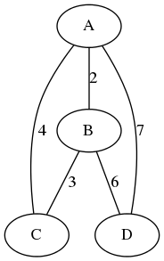
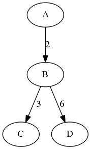

# Greedy Algorithms Day

I implemented Kruskal's algorithm for finding the minimum spanning tree.

I decided to use [the DOT
language](https://en.wikipedia.org/wiki/DOT_(graph_description_language)) to
represent the graphs and the [pydot](https://github.com/erocarrera/pydot) to
parse the DOT files and generate images of the graphs.

Here is an example graph, with its image representation:

```
graph G {
    A -- B [label=2];
    B -- C [label=3];
    A -- C [label=4];
    A -- D [label=7];
    B -- D [label=6];
}
```



## How to run

If you run `python minspantree.py graph.dot`, the program will parse the
`graph.dot` file and generate two files for the found minimum spanning tree:

* graph-found-mintree.dot with the resulting tree represented with the DOT language
* graph-found-mintree.png with an image of the resulting tree

For the above graph, the resulting image will look like:


